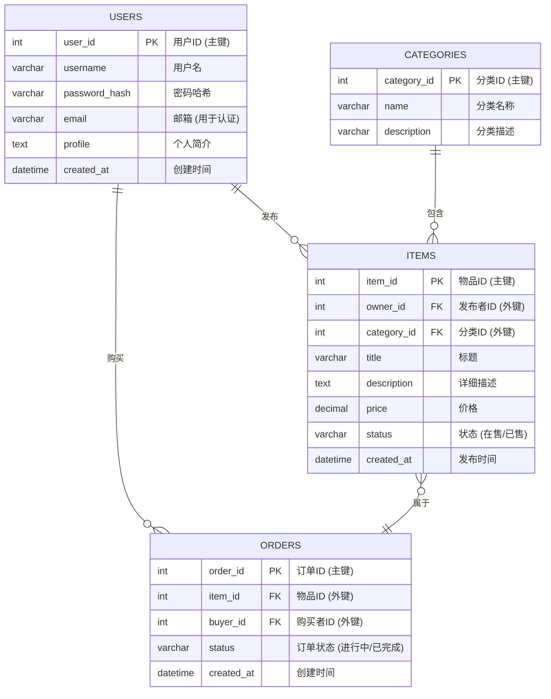

### **《校享易：校园闲置物品共享平台》项目计划书**

#### **1. 项目基本信息**

- **课题名称：** 校享易——校园闲置物品共享平台

- 项目类型：

   创新创业型Web应用 

- **指导教师：** （待定）

- 团队成员及分工：

  - **张嘉翊 (项目组长 & 后端主导)：** 负责项目整体规划、进度把控、后端架构设计 (Django)、核心模块开发及数据库模型设计。
  - **王舒星 (后端开发)：** 负责业务模块API开发 (Django REST Framework) 及API文档编写。
  - **徐袁扬 (前端主导 & UI/UX设计)：** 负责App的UI/UX设计、前端项目框架搭建 (Vue.js) 及主要页面开发。
  - **张俊杰 (前端开发 & 测试)：** 负责前端业务页面实现、API对接、项目测试及测试用例编写。

#### **2. 项目目标与内容**

- 总体目标：

   本项目旨在响应课程号召，通过一个完整的应用系统开发过程，将大学所学的理论知识融会贯通 。我们致力于培养团队独立分析、解决问题的能力以及协同工作的精神 ，为未来胜任企业开发打下坚实基础 。

- 项目内容：

   我们将调研、设计、开发并测试一个名为“校享易”的校园闲置物品共享平台 。该平台旨在解决校园内资源浪费问题，为在校学生提供一个安全、便捷的物品交易与租赁渠道。最终交付物包括一个可运行的Web应用、完整的源代码，以及一份详尽的实践报告。


#### **3. 可行性分析**

- 技术可行性：

  - 项目选用“Python阵营”的`Django + Vue.js`技术栈，成熟稳定，社区资源丰富 。

  - 团队成员已具备Python、前端基础和数据库知识，能够通过学习掌握项目所需技术。

  - 开发工具如`VSCode`、`Postman`均为免费且功能强大的软件，易于获取和使用 。
  
- 经济可行性：

  - 项目所需的核心软件（Python, Django, Vue.js, MySQL, VSCode）均为开源或免费软件，无软件采购成本。

  - 项目开发阶段可在本地环境进行，部署阶段可选用低成本或免费的云服务器，成本可控，符合学生项目特点 。

- 操作与进度可行性：

  - 项目整体时间从6月9日到7月6日左右，周期充足 。

  - 我们将采用迭代开发模式，每周向指导老师汇报进度，及时调整计划，确保项目风险可控 。

  - 项目功能规划清晰，可以分模块开发，适合团队并行工作 。


#### **4. 项目设计纲要**

项目将遵循软件工程规范，分阶段完成设计工作。

- 需求分析：

  - **功能需求：** 核心功能包括：支持学号认证的用户系统、物品发布与管理系统（支持图文）、分类与搜索系统、用户间在线沟通系统、订单与信用评价系统。
  - **非功能需求：** 界面友好易用、系统响应迅速、用户数据安全、具备良好的兼容性。

- 概要设计：

  - **技术架构**：

     采用前后端分离模式。前端为基于`Vue.js`的单页应用(SPA)；后端为基于`Django REST Framework`的`RESTful API`服务；数据库采用`MySQL`
  
- 详细设计：

  - **数据库设计**：

     设计用户表、物品表、订单表、消息表等，并使用E-R图清晰地表示实体间的关系（参照示例 ）。

  - **接口设计：** 定义详细的API端点，包括URL、请求方法、参数及返回数据格式。

  - **时序与流程设计**：

     为关键业务流程（如用户注册、购买商品等）绘制时序图和流程图，明确模块间的交互逻辑（参照示例 ）。


#### **5. 项目实施时间安排**

我们根据课程要求的时间节点，制定了详细的周度计划 。今天是6月16日，我们正处于第二周的起点。


| **周次**   | **核心任务**               | **主要交付成果**                                             |
| ---------- | -------------------------- | ------------------------------------------------------------ |
| **第一周** | **规划、设计与环境搭建**   | 1. 最终版需求文档。<br />2. 核心页面的UI/UX设计稿。<br />3. 详细的数据库ER图（见下文）。<br />4. 前后端Git仓库、开发环境和数据库搭建完毕。 |
| **第二周** | **后端核心API开发**        | 1. 完成用户模型 (Model) 及认证API（注册、登录）。<br />2. 完成物品模型及增、删、查、改 (CRUD) 的核心API。<br />3. 使用Postman完成所有API的单元测试。 |
| **第三周** | **前端开发与核心功能联调** | 1. 完成用户注册、登录页面的开发与API联调。<br />2. 完成物品列表页、详情页的开发与API联调。<br />3. 完成物品发布功能的前后端联调。 |
| **第四周** | **测试、部署与文档总结**   | 1. 对核心功能进行全面测试，修复Bug。<br />2. 将项目部署到线上测试服务器。<br />3. 撰写简版的项目报告和用户手册，准备成果演示。 |


E-R图




思维导图：[mindmap](https://mermaid-live.nodejs.cn/edit#pako:eNp1VV1T4lYY_itnzkXHnbJWqVbJ3VZ3O3a6M1utbafDTQoRWSVxQtjWOs6AgAUXEEdRC_gRVy1ba4JVAcmy_pmck8NV_0IPRMKH9AaS9-N53vd533OyAl2Cm4MM9Hl5t49dcvIAiIIgDeBjWa9e4P3tJw0TAAN1-c7IKfWTffr7YAOAYbwugR-YY8Ec-1QUXAucZPkshH8_ZOkzyl3W9_4xaooRf4-2Qyh6Rb3o7hptFlsZSMnqtSQN_4H7GVV3jJ2C5dkq4PwR9aBcjj47-VZR-SC-WkOxdXyY7l-UxPoX_JaLQuJYGRdkdLDXslnW6wJaT7StzR52VJwI1dcUQ7kiyilRQ71Zxh8aqmXaVnx0ZuTf6pW_9GpVv5dxSLW4m333cqPNLVQJ492i6e6mR4koSl-g3Ee8-ztajyLlrpfoQczYHpEL_X1EPcfhaIcvEad6GVeacZmrB-PdtHolqFdzaFMl4ZqRjdRPDtDpbi8zUg7xXomENtDp-05rAmduaBJRTlAyg29DeiVF9dO1_XYQVYTKRtSIrpX12rZxrVmjxOdr5DxElI9EkfuP0u-VOLqi7QU7LOHDCANQPInSKeNCbfR1rlk7E09SGwO-D3CDr_3gU_B8kfNxvDQ7ZUU0sxgw-ZrlPQKYfj7zHXghsj7uF0FcsFgyRZxUUHWbAS-XZ779pl1wLI229iknKp_1Lzjg58T27uHYFhgwtEg9cw8-AShawMexJ21pyM0RuXlnnjJDkY30OtXPrNBstGOExxV0H372agp9CNL9oXEktEOKYWvTtAit7BkYMNMfkeiVLNqQrfwO4FavJJLF-b8pMA3Ct2-JmunG_pJiN-V9hD079dnsj3RDjFSxYzeasXX5tn5wQgF0rYQSu93kJu5EC5cqZPI-IujE6q2_0ZJ6h1NntHJTyVbxrZltBHH-Qc_-M3MJnvbIiHpJCkEGvFqW5gXeBr5m37AzLtG7JFlDlenVU-rotGulbGBy-kWvDK2NtDX-wbQQkDjx_5ftIbN8hqLljnOkvTOOQxRpZoJe3x13UjxG54ZTf6JYiQFfeaUubUwxaDuCX_KxPLRBj-h1Q0YSA5wN-jjRxzZe4UojywmleXpenJChj26WHgjo5FdpzhLL_yQIvlaaKAQ885CZYxf99C2w5GYlbtLLeug5sqwix7s5cUII8BJkhu3j400UyKzAXyHjGBwbGnGMOez2IfuoY2zIzj0ds8FlyIwODo_YHZ-PfDE8PEqT7OPUsWqDvzXJ-cDiog1ybq8kiC_NT1jzS7b6H6ZvDYc)


思维导图代码：

```
mindmap
  root(校享易)
    (项目题目)
      ::icon(fa fa-rocket)
      校享易：校园闲置物品共享平台
      定位：Web应用
      周期：四周

    (需求分析)
      ::icon(fa fa-tasks)
      用户模块
        用户注册
            支持邮箱认证
        用户登录
        查看个人信息
      物品模块
        发布新物品
            包含图文内容
        查看物品列表
        查看物品详情
        按分类筛选物品
      一些可能的额外内容
        实时聊天
        完整的订单流与支付
        信用评价体系

    (概要设计)
      ::icon(fa fa-sitemap)
      架构: 前后端分离
      前端: Vue.js + ElementUI
      后端: Django REST Framework
      数据库: MySQL

    (成员分工)
      ::icon(fa fa-users)
      我 (组长 & 全栈)
        负责项目管理与后端架构
        核心API开发与联调
      组员A (后端)
        负责业务API开发
        数据库脚本与API测试
      组员B (前端)
        负责UI/UX实现
        前端页面组件化开发
      组员C (前端 & 测试)
        负责前端页面开发
        API对接与项目测试

    (技术架构)
      ::icon(fa fa-cogs)
      语言: Python, JavaScript
      框架
        后端: Django, DRF
        前端: Vue.js, Vue Router
      数据库: MySQL
      工具
        代码: VSCode
        版本控制: Git
        API测试: Postman
```

