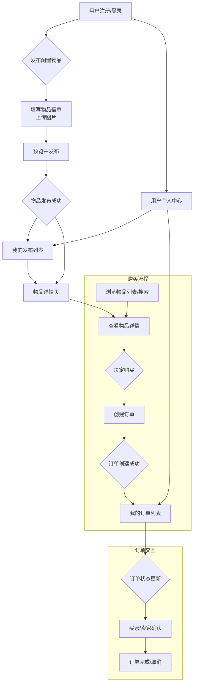
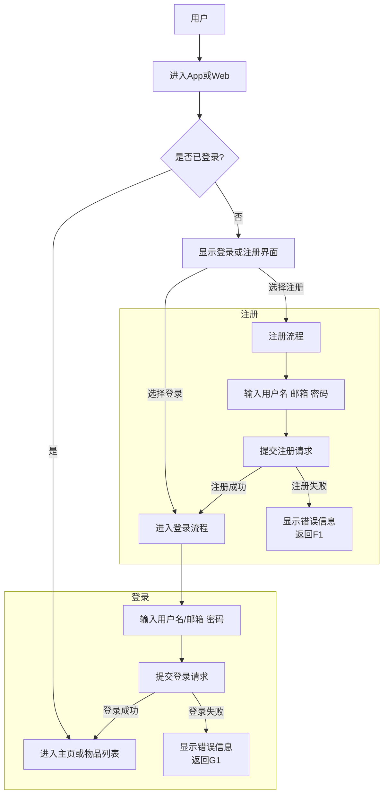
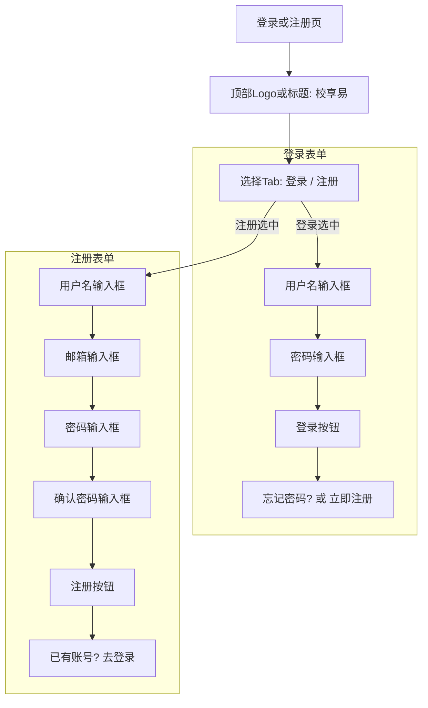
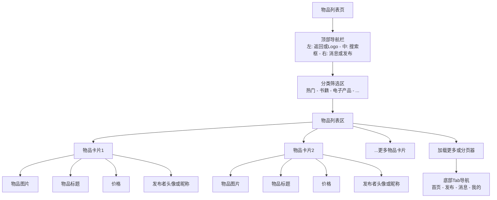
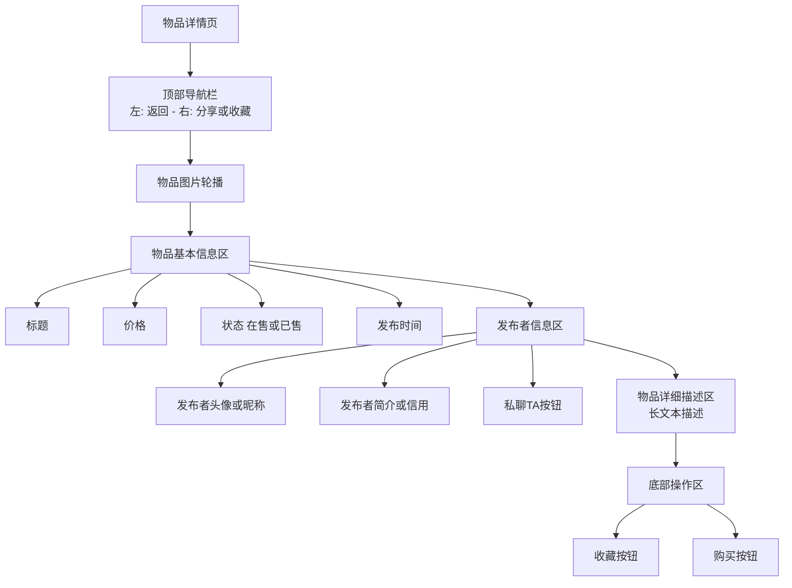
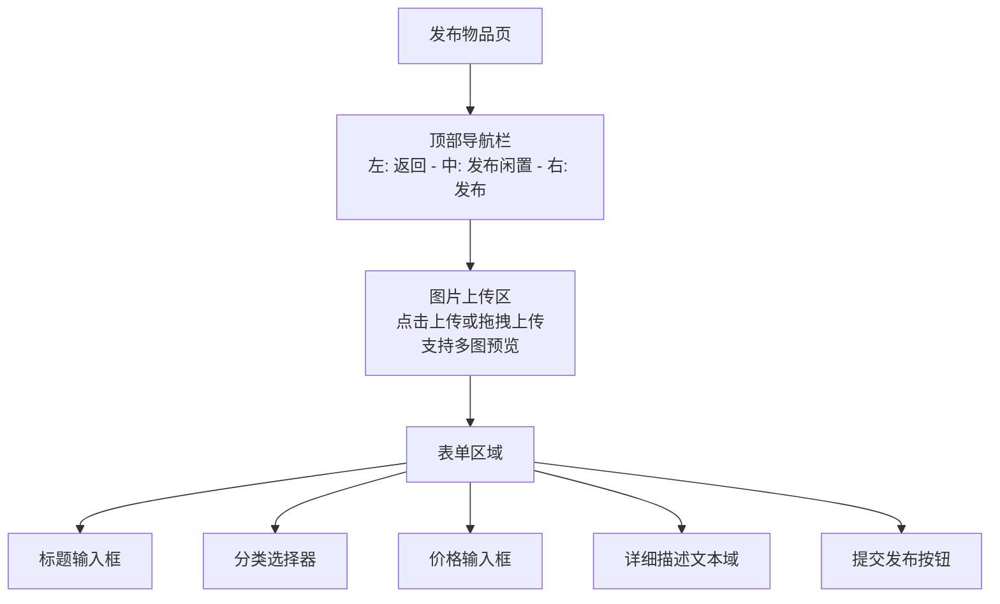
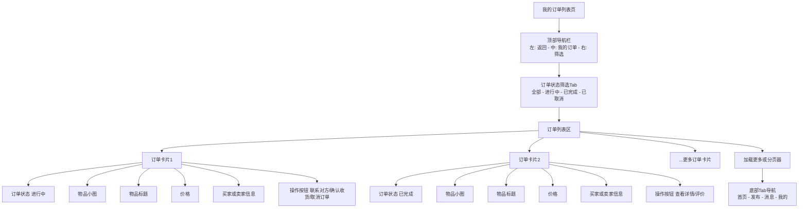

# 校享易：校园闲置物品共享平台

### 详细设计

1. **数据库设计**：略


2. **时序与流程设计**：

   - **关键业务流程的时序图**：
     
     - **用户注册流程**：用户输入信息 -> 前端发送注册请求 -> 后端验证信息（如邮箱格式、学号认证）-> 数据库存储用户信息 -> 返回注册结果。
     
       ``` mermaid
       sequenceDiagram
           actor User as 用户
           participant Frontend as 前端 (Vue.js App)
           participant Backend as 后端 (Django REST Framework)
           participant Database as 数据库 (MySQL)
       
           User->>Frontend: 访问注册页面，填写用户名、密码、邮箱
           Frontend->>Frontend: 客户端表单校验 (格式、非空)
           Frontend->>Backend: 发送注册请求 (POST /users/register/)
           Backend->>Backend: 接收请求，验证数据合法性 (如邮箱格式、用户名/邮箱是否已存在)
           Backend->>Database: 查询用户名或邮箱是否已存在
           Database-->>Backend: 返回查询结果
           alt 用户名或邮箱已存在
               Backend-->>Frontend: 返回错误响应 (400 Bad Request)
               Frontend-->>User: 显示错误信息
           else 用户名和邮箱均可用
               Backend->>Backend: 对密码进行哈希处理
               Backend->>Database: 存储新用户数据 (用户名、密码哈希、邮箱等)
               Database-->>Backend: 返回存储结果
               Backend-->>Frontend: 返回成功响应 (201 Created)
               Frontend-->>User: 显示注册成功信息，引导登录
           end
       ```
     
       
     
     - **用户登录流程**：用户输入凭证 -> 前端发送登录请求 -> 后端验证凭证 -> 生成并返回认证Token。
     
       ``` mermaid
       sequenceDiagram
           actor User as 用户
           participant Frontend as 前端 (Vue.js App)
           participant Backend as 后端 (Django REST Framework)
           participant Database as 数据库 (MySQL)
       
           User->>Frontend: 访问登录页面，输入用户名和密码
           Frontend->>Backend: 发送登录请求 (POST /users/login/)
           Backend->>Backend: 接收请求，查找用户
           Backend->>Database: 根据用户名查询用户记录
           Database-->>Backend: 返回用户记录
           alt 用户不存在或密码不匹配
               Backend->>Backend: 验证密码 (哈希值比对)
               Backend-->>Frontend: 返回错误响应 (401 Unauthorized)
               Frontend-->>User: 显示登录失败信息
           else 用户存在且密码匹配
               Backend->>Backend: 生成认证Token (JWT)
               Backend-->>Frontend: 返回成功响应 (200 OK) 和 Token
               Frontend->>Frontend: 存储Token (如localStorage)
               Frontend-->>User: 登录成功，跳转到主页或个人中心
           end
       ```
     
       
     
     - **发布物品流程**：用户填写物品信息（标题、描述、价格、分类、图片）-> 前端上传图片、发送发布请求 -> 后端处理图片、保存物品数据 -> 返回发布结果。
     
       ``` mermaid
       sequenceDiagram
           actor User as 用户
           participant Frontend as 前端 (Vue.js App)
           participant Backend as 后端 (Django REST Framework)
           participant Database as 数据库 (MySQL)
           participant CloudStorage as 云存储 (如OSS/七牛云,可选)
       
           User->>Frontend: 访问发布物品页面
           User->>Frontend: 填写物品信息 (标题、描述、价格、分类)
           User->>Frontend: 选择并上传物品图片 (多张)
           Frontend->>CloudStorage: (可选) 上传图片文件
           CloudStorage-->>Frontend: (可选) 返回图片URL
           Frontend->>Backend: 发送发布物品请求 (POST /items/)
           Frontend->>Backend: 请求头包含认证Token，请求体包含物品数据和图片URL列表
           Backend->>Backend: 接收请求，验证Token和数据合法性
           Backend->>Database: 存储物品数据 (item_id, owner_id, category_id, title, description, price, status等)
           Database-->>Backend: 返回存储结果
           Backend-->>Frontend: 返回成功响应 (201 Created)
           Frontend-->>User: 显示发布成功信息，跳转到物品详情页或我的发布
       ```
     
       
     
     - **购买商品流程**：用户选择商品 -> 前端发起购买请求 -> 后端创建订单 -> 更新物品状态 -> 返回订单信息。
     
       ```mermaid
       sequenceDiagram
           actor User as 用户 (买方)
           participant Frontend as 前端 (Vue.js App)
           participant Backend as 后端 (Django REST Framework)
           participant Database as 数据库 (MySQL)
           actor ItemOwner as 物品所有者 (卖方)
       
           User->>Frontend: 浏览物品列表/详情页，选择购买物品
           Frontend->>Backend: 发送创建订单请求 (POST /orders/)
           Frontend->>Backend: 请求头包含认证Token，请求体包含item_id
           Backend->>Backend: 接收请求，验证Token，校验物品状态 (是否在售，是否是自己发布的)
           Backend->>Database: 查询物品信息，检查库存或状态
           Database-->>Backend: 返回物品信息
           alt 物品不可购买 (已售、非在售状态、自己发布的)
               Backend-->>Frontend: 返回错误响应 (400 Bad Request)
               Frontend-->>User: 显示购买失败信息
           else 物品可购买
               Backend->>Database: 创建新订单记录 (order_id, item_id, buyer_id, status="进行中")
               Backend->>Database: 更新物品状态为 "进行中" (或锁定)
               Database-->>Backend: 返回订单创建结果和物品更新结果
               Backend-->>Frontend: 返回成功响应 (201 Created) 和订单信息
               Frontend-->>User: 显示订单创建成功信息，跳转到订单详情页
               Backend->>ItemOwner: (可选) 通知物品所有者有新订单
           end
       ```
     
       
     
     - **物品检索流程**：用户输入关键词或选择分类 -> 前端发送查询请求 -> 后端查询数据库 -> 返回物品列表。
     
       ```mermaid
       sequenceDiagram
           actor User as 用户
           participant Frontend as 前端 (Vue.js App)
           participant Backend as 后端 (Django REST Framework)
           participant Database as 数据库 (MySQL)
       
           User->>Frontend: 在搜索框输入关键词 或 选择分类
           Frontend->>Backend: 发送获取物品列表请求 (GET /items/)
           Frontend->>Backend: 请求包含查询参数 (search, category_id, page, page_size)
           Backend->>Backend: 接收请求，解析查询参数
           Backend->>Database: 根据查询参数从物品表进行数据查询、过滤和分页
           Database-->>Backend: 返回匹配的物品列表数据
           Backend-->>Frontend: 返回成功响应 (200 OK) 和物品列表数据
           Frontend->>Frontend: 渲染物品列表
           Frontend-->>User: 显示查询结果
       ```
     
       

   

3. **模块设计**：

   - 后端模块：
     - 用户管理模块：负责用户注册、登录、认证、个人信息管理。
     - 物品管理模块：负责物品的发布、查询、更新、删除、分类管理。
     - 订单管理模块：负责订单的创建、查询、状态更新。
     - 消息/沟通模块：如果实现在线沟通，需要设计消息的发送、接收、存储。
     - 图片上传模块：负责图片的存储和管理。
   - 前端模块/组件：
     - 认证模块：登录组件、注册组件。
     - 用户中心模块：个人信息页、我的发布、我的订单等。
     - 物品展示模块：物品列表组件、物品详情组件、物品卡片组件。
     - 物品发布模块：发布表单组件、图片上传组件。
     - 搜索与筛选模块：搜索框组件、分类导航组件。
     - 订单模块：订单列表、订单详情组件。
     - 消息组件：聊天界面、消息列表。


### 原型设计

#### **1. 用户流程图**

##### 1.1 核心用户流程：发布物品与订单管理



##### 1.2 注册/登录流程细化



#### **2. 关键页面示意图**

##### 2.1 登录/注册页面示意图



##### 2.2 物品列表页示意图



##### 2.3 物品详情页示意图



##### 2.4 发布物品页面示意图



##### 2.5 我的订单列表页面示意图




